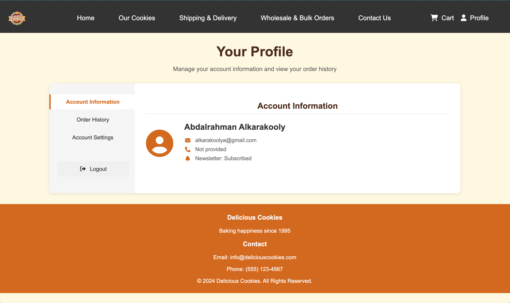
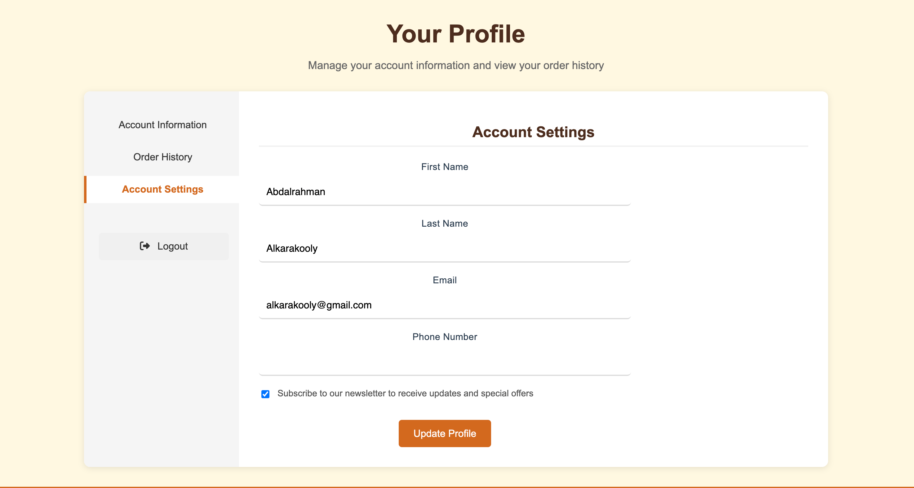

# Cookie Website

A delightful e-commerce website dedicated to selling artisanal, freshly-baked cookies. Our platform offers a seamless shopping experience for cookie enthusiasts to browse, order, and enjoy premium quality cookies delivered right to their doorstep.

## Features

- Browse and purchase delicious cookies
- User authentication and profile management
- Shopping cart functionality
- Order tracking and history
- Responsive design for all devices
- Newsletter subscription
- Wholesale and bulk order options

## User Profile Features

- View and update personal information (name, email, phone)
- Track order history with details (date, status, total)
- Manage newsletter preferences
- Secure authentication system

### Setup instructions (how to run it locally)

1. Clone the repository
       Open your terminal or command prompt and run the following command to clone the repository to your local machine:
        git clone (repository link), this will create a local copy of the repository.

2. Navigate to the project directory
        Once repository is cloned, navigate into the project using cd cookieWebsite

3. Set up a virtual environment (recommended)
        Create a virtual environment to manage the dependencies for the project.
        For macOS/Linux:
        python3 -m venv env
        source env/bin/activate
        
        For Windows:
        python -m venv env
        .\env\Scripts\activate

4. Install the required dependencies
       Now that the virtual environment is activated, install the necessary Python dependencies from the requirements.txt file by running the following command:
       pip install -r requirements.txt

5. Set up the database
       You need to set up the SQLite database for the project to work. To do this, run the following command to initialize the database:
       python app.py

6. Run the application
       Now that everything is set up, you can start the Flask development server. Run the following command:
        flask run
        The application will be available at http://127.0.0.1:5000

### How to use the App

1. Create an Account
   - Click on "Profile" in the navigation bar
   - Choose "Sign Up" and fill in your details
   - Complete the registration process

2. Browse Cookies
   - Visit the "Our Cookies" section to view all available cookies
   - Click on any cookie to view more details about it
   - View descriptions and prices for each cookie

3. Shopping
   - Add cookies to your shopping cart by selecting quantity
   - View your cart by clicking the shopping cart icon
   - Adjust quantities as needed
   - Proceed to checkout when ready

4. Profile Management
   - Access your profile through the navigation bar
   - Update your personal information
   - View your order history
   - Manage newsletter preferences

### Screenshots

Here are some screenshots of the working project:

*The homepage of the cookie website.*

*Our cookies tab, displaying a list of available cookies.*

*Detailed view of a single cookie with options to add to the cart.*

### Security Features

- Secure password hashing using SHA-256
- Session management for user authentication
- CSRF protection for forms
- Input validation and sanitization
- Secure database operations with SQLite

### License

© 2024 Delicious Cookies. All Rights Reserved.
