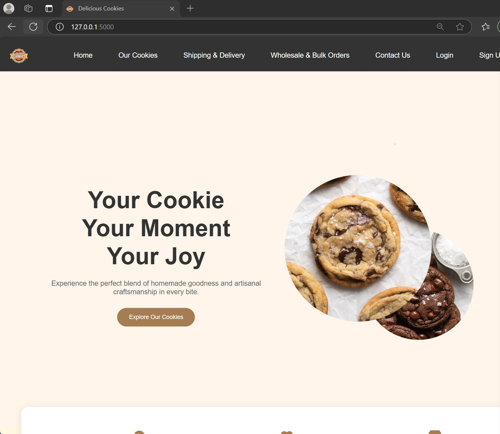
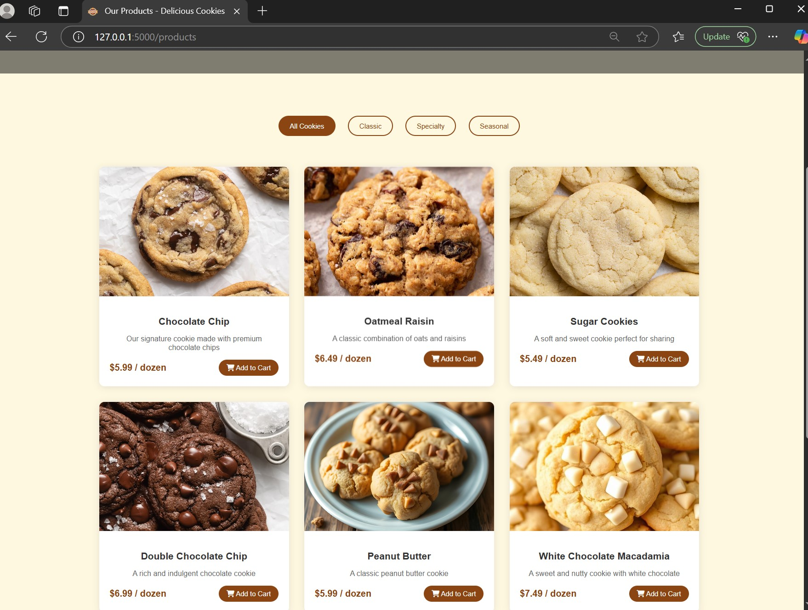
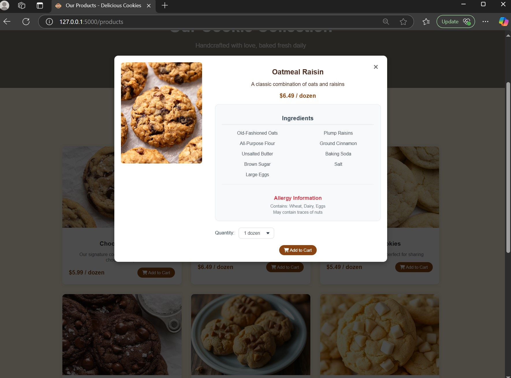

# Cookie Website 🍪

A delightful e-commerce website dedicated to selling artisanal, freshly-baked cookies. Our platform offers a seamless shopping experience for cookie enthusiasts to browse, order, and enjoy premium quality cookies delivered right to their doorstep.

## 🔧 New Feature: User Profile with Order History

- View your name, email, phone number, and newsletter preferences
- See past orders including order date, quantity, status, and total cost
- 
### Setup instructions (how to run it locally)
1. Clone the repository
       Open your terminal or command prompt and run the following command to clone the repository to your local machine:
        git clone (repository link), this will create a local copy of the repository.

2. Navigate to the project directory
        Once repository is cloned, navigate into the project using cd cookieWebsite

3. Set up a virtual environment (recommended)
        create a virtual environment to manage the dependencies for the project.
        run the command python -m venv venv

4. Install the required dependencies
       Now that the virtual environment is activated, install the necessary Python dependencies from the requirements.txt file by running the following command:
       pip install -r requirements.txt

5. Set up the database`
       You need to set up the SQLite database for the project to work. To do this, run the following command to initialize the database:
       python app.py

6. Run the application
       Now that everything is set up, you can start the Flask development server. Run the following command:
        flask run

### How to use the App

1. Browse Cookies: When you visit the homepage, you can view a list of all available cookies along with their descriptions and prices.

2. View Cookie Details: Click on any cookie to view more details about it.

3. Add to Cart: Add cookies to your shopping cart by selecting a quantity and clicking "Add to Cart."

4. View Cart: You can view all the cookies you’ve added to your cart by clicking the shopping cart icon.

5. Checkout: When you're ready, proceed to checkout and place your order (optional for now).

#Screenshots

#### Here are some screenshots of the working project:

*The homepage of the cookie website.*

*Our cookies tab, displaying a list of available cookies.*

*Detailed view of a single cookie with options to add to the cart.*