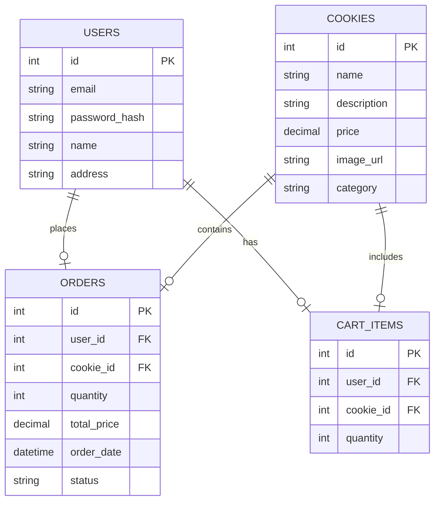
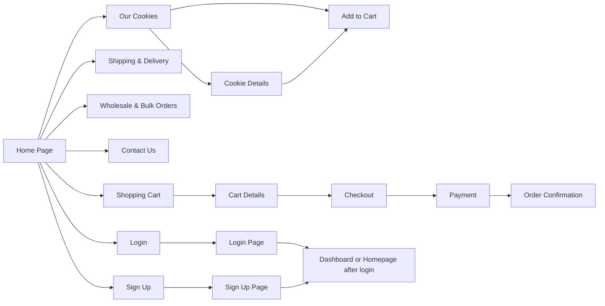

### App Description

The Cookie Website is an e-commerce platform dedicated to selling artisanal, freshly baked cookies. The platform offers users an easy way to browse a variety of cookies, add them to a shopping cart, and proceed with the checkout process to have them delivered to their doorstep. Users can view cookie details and explore various flavors and pricing.

### Feature List

#### Required Features (Must-have for minimum functionality)

    -Home: Displays an introduction to the Cookie Website and highlights featured cookies.
    -Our Cookies Page: Users can browse different cookie varieties available for purchase.
    -Shipping & Delivery Page: Displays details regarding shipping options, costs, and delivery times.
    -Wholesale & Bulk Orders Page: Offers information about bulk order discounts and options for businesses or large events.
    -Contact Us Page: Allows users to contact the website team for inquiries or support.
    -Login Page: Users can log in to their accounts to manage their orders or track their purchases.
    -Sign Up Page: Users can create a new account on the website.
    -Shopping Cart: Users can view their cart items, including the number of items and total quantity.

#### Should Have Features (Adds more value but not critical)

    -Search Bar: Users can search for specific cookies by name or ingredient.   
    -Responsive Design: Ensure that the website is optimized for mobile and tablet views.
    -User Reviews for Cookies: Allow customers to leave reviews or ratings for cookies.
    -Interactive Cookie Filtering: Filter cookies by categories like chocolate, nuts, or special diets (e.g., gluten-free).

#### Nice to Have Features (If there’s extra time)
    -Order History for Users: Allow users to view their past orders.
    -Admin Dashboard: A dashboard where an admin can manage cookies, process orders, and handle customer queries.
    -Email Notifications: Send automatic confirmation emails for orders, sign-ups, and more.
    -Password Recovery: Implement a password reset or recovery system for users.

### User Stories
    -As a customer, I want to browse the cookies available on the website so I can find the ones I want to purchase.
    -As a customer, I want to view detailed information about each cookie, such as the ingredients and price.
    -As a customer, I want to add cookies to my cart so I can later proceed to checkout.
    -As a customer, I want to learn about shipping costs and delivery times before making my purchase.
    -As a customer, I want to log in to my account to view or update my order information.
    -As an admin, I want to manage and update cookie products and information to ensure accurate data on the site.
    -As a customer, I want to contact the business if I have questions or need support.

### Database Schema (ERD) 

### User Flow Diagram

### List of Endpoints

### List of Endpoints – Routes (GET/POST) and Expected Input/Output

| Route                         | Method  | Input                                              | Output                                            |
|-------------------------------|---------|----------------------------------------------------|---------------------------------------------------|
| `/`                           | GET     | None                                               | Renders `index.html` (Home Page)                  |
| `/products`                   | GET     | None                                               | Renders `products.html` (List of Products)        |
| `/shipping`                   | GET     | None                                               | Renders `shipping.html` (Shipping info)           |
| `/wholesale`                  | GET     | None                                               | Renders `wholesale.html` (Wholesale info)         |
| `/contact`                    | GET     | None                                               | Renders `contact.html` (Contact Form)             |
| `/login`                      | GET     | None                                               | Renders `login.html` (Login Form)                 |
| `/cart`                       | GET     | None                                               | Renders `cart.html` (Shopping Cart)               |
| `/signup`                     | GET     | None                                               | Renders `signup.html` (Sign-Up Form)              |
| `/cart/add/<int:cookie_id>`   | POST    | `cookie_id`: ID of the cookie, `quantity`: Quantity of the cookie | Updates the cart and redirects to `/cart`          |
| `/cart/remove/<int:cookie_id>`| POST    | `cookie_id`: ID of the cookie to remove           | Updates the cart and redirects to `/cart`          |
| `/login`                      | POST    | `email`: User's email, `password`: User's password | Redirects to dashboard/home or shows error if invalid |
| `/signup`                     | POST    | `email`: User's email, `password`: User's password, `name`: User's full name, `address`: Shipping address | Redirects to login or home page, or shows error if invalid |
| `/checkout`                   | GET     | None                                               | Renders `checkout.html` (Checkout Page)           |
| `/payment`                    | POST    | Payment details (e.g., credit card information)    | Redirects to `order_confirmation.html` or shows payment error |
| `/order/confirmation`         | GET     | None                                               | Renders `order_confirmation.html` (Order Summary) |

